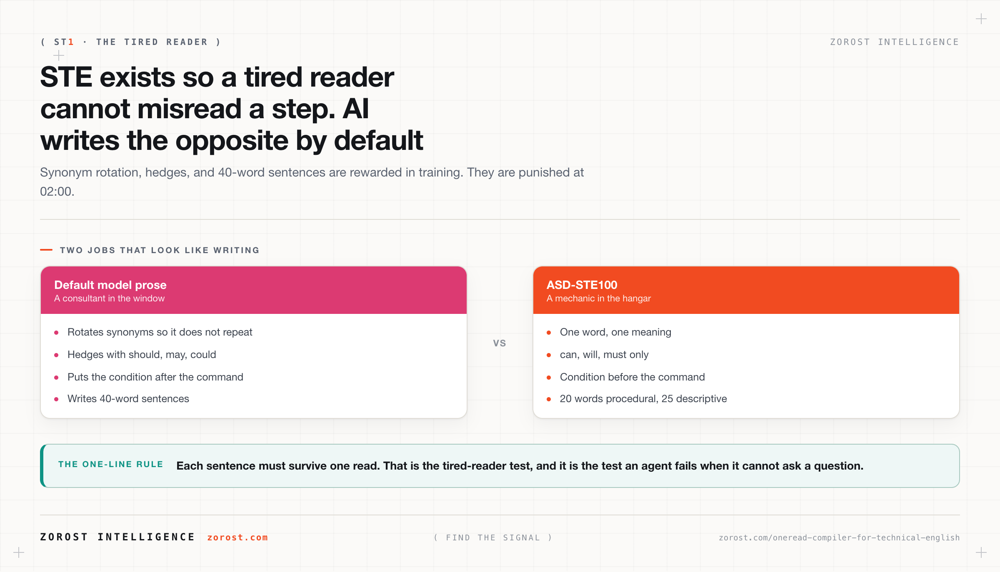
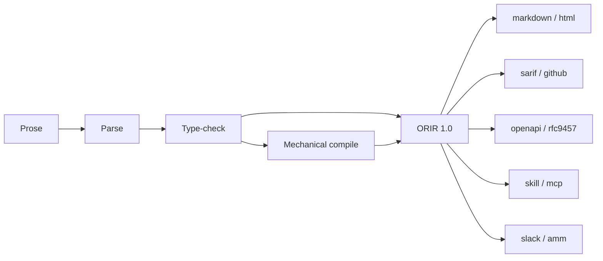
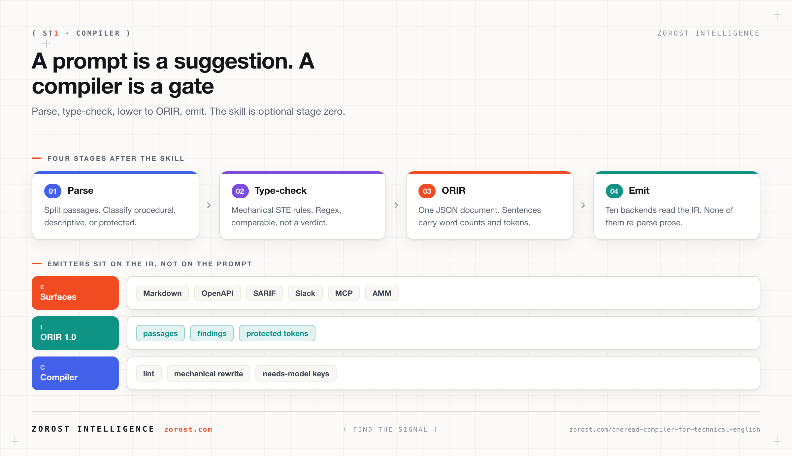
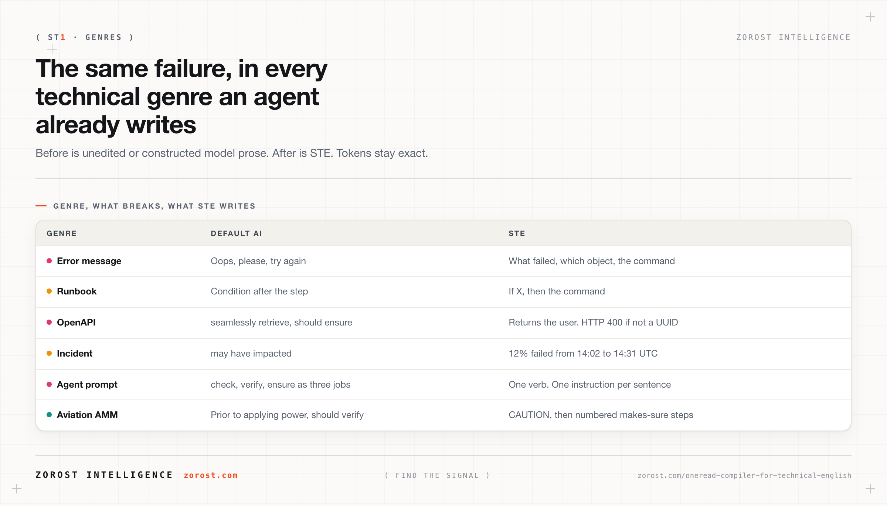
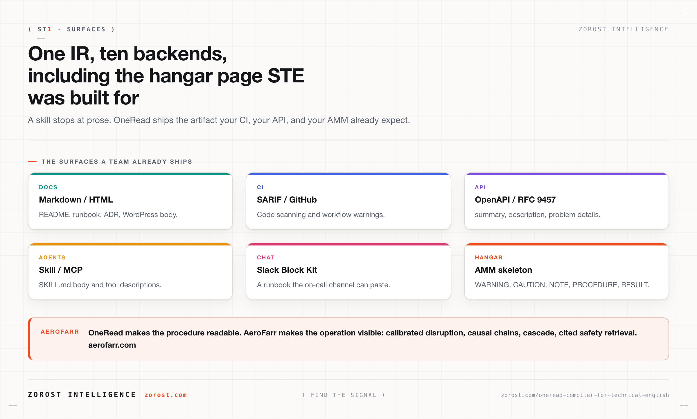

<div align="center">

# OneRead

### A compiler for technical English

**Type-check AI prose against ASD-STE100 Issue 9. Lower it to one IR. Emit it to every surface you already ship.**

[Playground](https://zorost.github.io/oneread/) · [Signals post](https://zorost.com/oneread-compiler-for-technical-english/) · [Official STE](https://www.asd-ste100.org/) · [AeroFarr](https://aerofarr.com)

[](LICENSE)
[](pyproject.toml)
[](pyproject.toml)
[](NOTICE)

</div>

---

A language model writes like a consultant. An aircraft mechanic writes so a tired colleague cannot misread a step. Those are not the same job. [ASD-STE100 Simplified Technical English](https://www.asd-ste100.org/) is the controlled language aerospace built for the second job. Issue 9 is dated 15 January 2025. Fifty-three writing rules. A copyrighted dictionary OneRead does not reproduce.

People have packaged those rules as agent skills. A skill is still a prompt. The model will try. The next call drifts. CI cannot fail a prompt.

**OneRead is a compiler.** Parse the prose. Type-check the mechanical rules. Lower the document to **ORIR** (OneRead Intermediate Representation). Emit the same IR to Markdown, HTML, SARIF, GitHub annotations, Slack Block Kit, OpenAPI, SKILL.md, MCP tool descriptions, RFC 9457 problem details, and an aviation AMM skeleton.

Interactive rule explorer, live linter, and emitter preview: **[zorost.github.io/oneread](https://zorost.github.io/oneread/)**.

Unofficial. Not affiliated with ASD or STEMG. No tool can guarantee compliance.



## Quick start

```bash
git clone https://github.com/zorost/oneread.git
cd oneread
python3 -m pip install -e .
python3 -m oneread.cli self-test
python3 -m oneread.cli lint fixtures/slop/readme.md --type descriptive --report
python3 -m oneread.cli compile fixtures/slop/error.md --type procedural --report
python3 -m oneread.cli emit fixtures/slop/runbook.md --type procedural --to markdown,sarif,amm --out /tmp/oneread
```

Exit code 1 from `lint` means mechanical findings remain. That is the CI gate.

## A skill versus a compiler

| | Agent skill (prompt) | OneRead (compiler) |
|---|---|---|
| Tells the model the rules | Yes | Yes, as one adapter |
| Deterministic linter | No | Line-level findings |
| Intermediate representation | No | ORIR 1.0 (`schema/orir.schema.json`) |
| Emit to ten surfaces | No | Markdown, HTML, SARIF, GitHub, Slack, OpenAPI, skill, MCP, RFC 9457, AMM |
| GitHub Action | No | `adapters/github-action/` |
| MCP server | No | `adapters/mcp/server.py` (stdlib stdio) |
| Interactive playground | No | `playground/` |
| Official dictionary | Not reproduced | Not reproduced |
| Certifies STE | No | No |
| CI can fail it | No | `lint` exit 1 |

A skill can look clean on a good call. The next call puts check, verify, and ensure back in. CI cannot fail a prompt. OneRead is the gate behind the skill.

## Pipeline





The compiler rewrites contractions, Latin abbreviations, courtesy filler, wordy phrases, semicolons, em dashes, and a few phrasal verbs. It marks the rest `needs_model`: sentence splits, banned modals that change meaning, `-ing` clauses, trailing conditions, synonym rotation. A skill or a human finishes those. CI fails on whatever remains.

Docs: [architecture](docs/architecture.md) · [ORIR spec](docs/ir-spec.md) · [emitters](docs/emitters.md) · [why](docs/why.md) · [aviation](docs/aviation.md)

## Before / after

**Error message**

> Before: Oops! Something went wrong while attempting to establish a connection to the database. Please ensure your credentials have been properly configured and try again.
>
> After: Connection to the database failed. The password for user `app` was not correct. Set `DB_PASSWORD` to the correct value, then connect again.

**Runbook**

> Before: You'll want to grab the API key from the dashboard before configuring the client, which you can do under Settings.
>
> After: Get the API key from the dashboard, under Settings. Then configure the client with this key.

**OpenAPI**

> Before: This endpoint allows you to seamlessly retrieve a user by ID, leveraging our robust lookup pipeline. You should ensure the ID is valid; otherwise an error may be returned.
>
> After: Returns the user with the given `id`. If `id` is not a UUID, the API returns HTTP 400.

**Aviation**

> Before: Prior to applying power, the technician should verify that the hydraulic lines have been properly connected, making sure there is no leakage, and/or that the reservoir is filled.
>
> After: CAUTION: Do not apply electrical power until this task is complete. 1. Make sure that the hydraulic lines are connected. 2. Make sure that there is no leak. 3. Make sure that the reservoir is full. 4. Then apply power.

More pairs: `fixtures/slop/` and `fixtures/compiled/`. Model-shaped inputs (Claude documented, GPT/Gemini/Kimi constructed and labeled): `fixtures/models/`.



## Install on every harness

**Python CLI (the compiler)**

```bash
python3 -m pip install -e .
```

**Cursor / Claude Code / Codex / Gemini CLI / OpenCode (the skill adapter)**

Copy `adapters/skills/` into the skills directory your harness reads, or paste `adapters/skills/system-prompt.md` into `AGENTS.md`. The skill tells the model to *run the compiler*, not to pretend it is one.

**MCP**

```json
{
  "mcpServers": {
    "oneread": {
      "command": "python3",
      "args": ["adapters/mcp/server.py"]
    }
  }
}
```

Tools: `oneread_lint`, `oneread_compile`, `oneread_emit`.

**GitHub Action**

```yaml
- uses: zorost/oneread/adapters/github-action@main
  with:
    path: docs
    type: descriptive
```

**pre-commit**

See `adapters/pre-commit-hook.yaml`.

## 53 rules, in the browser

Open `playground/index.html` or [zorost.github.io/oneread](https://zorost.github.io/oneread/). Click a rule. See the rewrite. Paste your own README. The meters move.

The playground is part of the product. A change to `src/oneread/lint.py` that is not mirrored in `playground/linter.js` is an incomplete change.

## Aviation, and AeroFarr

STE was requested by European airlines in the late 1970s so maintenance documentation could be read with a basic command of English. OneRead emits an AMM-shaped procedure from the same IR you use for a README.

The operational picture around that aircraft is a different product. [AeroFarr](https://aerofarr.com) is Zorost's aviation intelligence platform: calibrated pre-departure disruption forecasts, causal explanation, network cascade, and retrieval over public aviation safety corpora with citations. OneRead makes the procedure readable. AeroFarr makes the operation visible. They are not the same system.



## Limits

- Regex, not a parser. Passive voice and part of speech are undercounted.
- The official dictionary is not in this repo. Strict vocabulary needs Issue 9.
- Do not apply STE to marketing, brand, or social posts.
- Do not rewrite legal or statutory wording.
- Do not claim certification.

## License

MIT. Copyright Fereydon Hashemi and Zorost Intelligence, 2026. Trademark notice: `NOTICE`.

Signals write-up: [zorost.com/oneread-compiler-for-technical-english](https://zorost.com/oneread-compiler-for-technical-english/)
